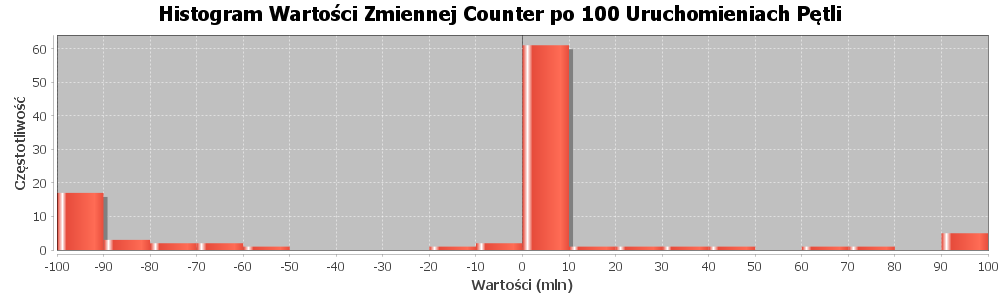
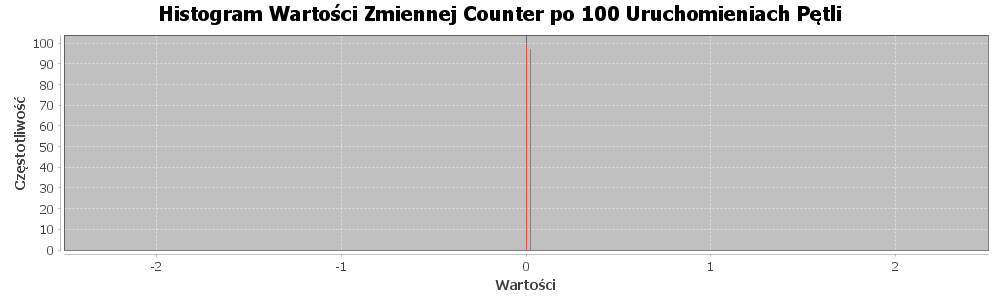

### [Laboratorium 1](https://artemis.wszib.edu.pl/~funika/pwir/tw/lab1/)
# Temat: Współbieżność w Javie
### **Andrzej Kotulski**
#### 06.10.2024r.

---


## 1. Co było do zrobienia

Celem zadania było zaimplementowanie programu symulującego wyścig dwóch operacji na współdzielonej zmiennej licznikowej `counter`. Zmienna ta&nbsp;była modyfikowana przez dwie metody: `inc()` (inkrementacja) oraz `dec()` (dekrementacja). Obie operacje były wykonywane naprzemiennie w&nbsp;pętli, co&nbsp;wprowadzało ryzyko wystąpienia warunku wyścigu.

Zadaniem było:

1. Zaobserwowanie, jak zmienia się stan zmiennej `counter` po&nbsp;wykonaniu 1&nbsp;miliona operacji przy jednoczesnym wykonywaniu operacji inkrementacji i&nbsp;dekrementacji.

2. Przeprowadzenie testu, w&nbsp;którym wykonuje się 100 iteracji tego procesu i&nbsp;tworzy histogram wartości zmiennej `counter`, aby zaobserwować, jak często pojawiają się różne wyniki.

3. Zaproponowanie autorskiego rozwiązania problemu warunku wyścigu, które nie korzysta z&nbsp;wbudowanych mechanizmów synchronizacyjnych dostępnych w&nbsp;Javie.


## 2. Podejście do rozwiązania problemu

Podejście do rozwiązania zostało podzielone na&nbsp;trzy etapy:

1. **Podstawowa implementacja licznika (`CounterV1`)** - zaimplementowano prosty licznik bez zabezpieczeń przed warunkiem wyścigu. Dwie operacje (`inc` i&nbsp;`dec`) były wykonywane jednocześnie przez osobne wątki, co&nbsp;prowadziło do&nbsp;nieprzewidywalnych wyników w&nbsp;zmiennej `counter`.

2. **Implementacja z użyciem mechanizmów systemowych (`CounterV2`)** - w&nbsp;celu zabezpieczenia operacji na&nbsp;liczniku, zastosowano wbudowane mechanizmy synchronizacji w&nbsp;Javie (słowo kluczowe `synchronized`). Dzięki temu operacje były wykonywane atomowo, a&nbsp;zmienna `counter` osiągała stabilny wynik.

3. **Autorskie rozwiązanie problemu warunku wyścigu (`CounterV3`)** - zamiast korzystać z&nbsp;mechanizmów synchronizacyjnych Javy, zaproponowano rozwiązanie wykorzystujące mechanizm zegara (`Clock`) do&nbsp;kontrolowania dostępu do&nbsp;wspólnej zmiennej. Wątki mogą wykonywać swoje operacje tylko wtedy, gdy ich slot czasowy jest aktywny. Zegarek działa w&nbsp;osobnym wątku, przełączając aktywne sloty co&nbsp;określony czas.
 
Do wizualizacji wyników wykorzystano bibliotekę `JFreeChart`, która umożliwiła wygenerowanie histogramu przedstawiającego rozkład wartości zmiennej counter po&nbsp;wielokrotnym uruchomieniu pętli.

## 3. Fragmenty kodu

### Klasa z parametrami:

```Java
public class RaceParams {
    public static final int LENGTH = 100_000_000;
    public static final int PROCES_COUNT = 100;
    public static final boolean EXECUTE_PARALLEL = true;
}
```


### Interfejs Counter:

```Java
public interface Counter {
    void inc();

    void dec();

    int value();
}
```


### Wątek Inkrementujący:

```Java
class IThread extends Thread {
    private final Counter counter;

    IThread(Counter counter) {
        this.counter = counter;
    }

    public void run() {
        for (int i = 0; i < RaceParams.LENGTH; i++) {
            counter.inc();
        }
    }
}
```


### Wątek Dekrementujący:

```Java
class DThread extends Thread {
    private final Counter counter;

    public DThread(Counter counter) {
        this.counter = counter;
    }

    public void run() {
        for (int i = 0; i < RaceParams.LENGTH; i++) {
            counter.dec();
        }
    }
}
```


### Implementacja Podstawowego Licznika:

```Java
public class CounterV1 implements Counter {
    private int _val;

    public CounterV1(int n) {
        _val = n;
    }

    @Override
    public void inc() {
        _val++;
    }

    @Override
    public void dec() {
        _val--;
    }

    @Override
    public int value() {
        return _val;
    }
}
```


### Implementacja Licznika (**z użyciem** wbudowanych mechanizmów Java):

```Java
public class CounterV2 implements Counter {
    private int _val;

    public CounterV2(int n) {
        _val = n;
    }

    @Override
    public synchronized void inc() {
        _val++;
    }

    @Override
    public synchronized void dec() {
        _val--;
    }

    @Override
    public int value() {
        return _val;
    }
}
```


### Implementacja Licznika (**bez użycia** wbudowanych mechanizmów Java):

```Java
public class CounterV3 implements Counter {
    private int _val;
    private final Clock clock;
    private static final int INC_SLOT = 0;
    private static final int DEC_SLOT = 2;

    public CounterV3(int n) {
        this._val = n;
        this.clock = new Clock(200);
        clock.start();
    }

    @Override
    public void inc() {
        while (true) {
            if (clock.isActiveSlot(INC_SLOT)) {
                int tickId = clock.getTickId();
                int counter = _val + 1;
                if (tickId == clock.getTickId()) {
                    _val = counter;
                    break;
                }
            } else {
                Thread.yield();
            }
        }
    }

    @Override
    public void dec() {
        while (true) {
            if (clock.isActiveSlot(DEC_SLOT)) {
                int tickId = clock.getTickId();
                int counter = _val - 1;
                if (tickId == clock.getTickId()) {
                    _val = counter;
                    break;
                }
            } else {
                Thread.yield();
            }
        }
    }

    @Override
    public int value() {
        return _val;
    }
}
```


### Klasa `Clock`:

```Java
class Clock extends Thread {
    private final int timeSlice;
    private int currentSlot;
    private int tickId;

    public Clock(int timeSlice) {
        this.timeSlice = timeSlice;
        this.currentSlot = 0;
        this.tickId = 0;
    }

    @Override
    public void run() {
        while (true) {
            try {
                Thread.sleep(timeSlice);
                tickId++;
                currentSlot = (currentSlot + 1) % 4;
            } catch (InterruptedException e) {
                break;
            }
        }
    }

    boolean isActiveSlot(int slot) {
        return currentSlot == slot;
    }

    int getTickId() {
        return tickId;
    }
}
```


### Klasa `Race`:

```Java
public class Race {
    public static void main(String[] args) throws InterruptedException, IOException {
        int counterVersion = 1;
        if (args.length != 0) {
            counterVersion = Integer.parseInt(args[0]);
        }

        Histogram histogram = new Histogram(HistogramParamsFactory.createHistogramParams(counterVersion));

        Thread[] threads = new Thread[RaceParams.PROCES_COUNT];

        for (int i = 0; i < RaceParams.PROCES_COUNT; i++) {
            Counter cnt = CounterFactory.createCounter(counterVersion, 0);
            threads[i] = new RaceThread(cnt, histogram);
            threads[i].start();

            if (!RaceParams.EXECUTE_PARALLEL) {
                threads[i].join();
            }
        }

        if (RaceParams.EXECUTE_PARALLEL) {
            for (Thread thread : threads) {
                thread.join();
            }
        }

        histogram.print();
    }
}
```

### Klasa `RaceThread`:
```Java
public class RaceThread extends Thread {
    private final Counter cnt;
    private final Histogram histogram;

    public RaceThread(Counter cnt, Histogram histogram) {
        this.cnt = cnt;
        this.histogram = histogram;
    }

    @Override
    public void run() {
        IThread iThread = new IThread(cnt);
        DThread dThread = new DThread(cnt);

        Random random = new Random();
        if (random.nextBoolean()) {
            iThread.start();
            dThread.start();
        } else {
            dThread.start();
            iThread.start();
        }

        try {
            iThread.join();
            dThread.join();
        } catch (InterruptedException e) {
            Thread.currentThread().interrupt();
        }

        int finalValue = cnt.value();
        histogram.put(finalValue);
        System.out.println(finalValue);
    }
}
```

## 4. Wyniki

### Wynik działania programu `Race` z licznikiem `CounterV1`:


### Wynik działania programu `Race` z licznikiem `CounterV2`:


### Wynik działania programu `Race` z licznikiem `CounterV3`:


## 5. Wnioski

W trakcie realizacji zadania zaobserwowano różnice w&nbsp;zachowaniu aplikacji w&nbsp;zależności od&nbsp;zastosowanego podejścia do&nbsp;zarządzania współbieżnością:

1. **Wersja bez synchronizacji (`CounterV1`)**: W&nbsp;tej implementacji operacje na&nbsp;zmiennej counter były wykonywane bez jakichkolwiek zabezpieczeń, co&nbsp;prowadziło do&nbsp;wystąpienia warunku wyścigu. Efekt końcowy był losowy, co&nbsp;było wyraźnie widoczne na&nbsp;histogramie. Taki wynik jest typowy w&nbsp;przypadku braku synchronizacji w&nbsp;kontekście współbieżnego dostępu do&nbsp;wspólnych zasobów.

2. **Wersja z synchronizacją (`CounterV2`)**: Zastosowanie wbudowanych mechanizmów synchronizacji w&nbsp;Javie (słowo kluczowe `synchronized`) zapewniło poprawne wykonywanie operacji inkrementacji i&nbsp;dekrementacji. W&nbsp;tej wersji, zmienna `counter` po&nbsp;każdej iteracji przyjmowała wartość zero, co&nbsp;było oczekiwanym rezultatem i&nbsp;potwierdzało skuteczność mechanizmu synchronizacji.

3. **Autorskie rozwiązanie (`CounterV3`)**: Proponowane rozwiązanie, oparte na mechanizmie zegara do&nbsp;kontrolowania kolejności operacji, okazało się efektywne w eliminacji warunku wyścigu. Dzięki temu wątki mogły wykonywać swoje operacje w odpowiednich aktywnych slotach czasowych. Końcowe wartości zmiennej counter były takie jak te uzyskane w&nbsp;wersji z&nbsp;synchronizacją.

Podsumowując, synchronizacja jest kluczowym elementem w&nbsp;zarządzaniu współbieżnością.


## 6. Bibliografia

1. **Java Platform, Standard Edition Documentation** - Oracle. Dostępne online: <https://docs.oracle.com/javase/8/docs/>

2. **JFreeChart Developer Guide** - JFreeChart Documentation. Dostępne online: <https://www.jfree.org/jfreechart/>


## 7. Załączniki

1. **Repozytorium kodu źródłowego** – Pełny kod projektu. Dostępne online: <https://github.com/akotu235/Race>