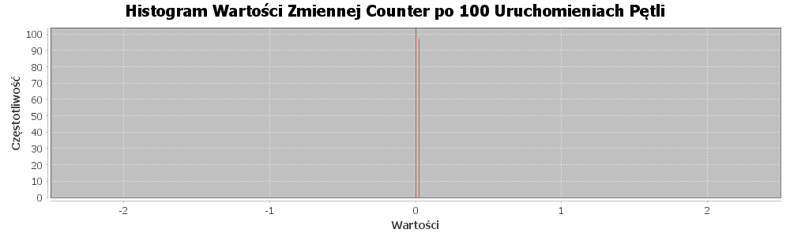

### [Laboratorium 2](https://artemis.wszib.edu.pl/~funika/pwir/tw/lab2/)
# Temat: Współbieżność w Javie
### **Andrzej Kotulski**
#### 20.10.2024r.

---


## 1. Co było do zrobienia

Celem zadania było kontynuowanie analizy problemu wyścigu w&nbsp;Javie z&nbsp;poprzedniego laboratorium i&nbsp;próba jego rozwiązania z&nbsp;wykorzystaniem semaforów. Zadanie obejmowało również analizę sposobu działania mechanizmów monitorów w&nbsp;Javie oraz metod synchronizacji, w&nbsp;tym metod `wait`, `notify` oraz `notifyAll`.


## 2. Podejście do rozwiązania problemu

Problem wyścigu rozwiązano poprzez implementację semafora synchronizującego dostęp wątków do&nbsp;wspólnego zasobu. Rozwiązanie to&nbsp;blokuje krytyczne sekcje, zapobiegając jednoczesnej modyfikacji licznika przez wiele wątków.

Semafor został zaimplementowany w&nbsp;nowej wersji klasy licznika (`CounterV5`), gdzie odpowiednio zarządza blokadą dostępu do&nbsp;współdzielonego zasobu. Dzięki zastosowaniu interfejsu `Counter`, możliwe było wykorzystanie [kodu z poprzednich zajęć](https://github.com/akotu235/Race) do przeprowadzenia doświadczeń z nową wersją licznika.


## 3. Fragmenty kodu

### Implementacja Licznika (**z użyciem Semafora**):

```Java
public class CounterV5 implements Counter {
    private int _val;
    private final Semafor semafor;

    public CounterV5(int n) {
        _val = n;
        semafor = new Semafor();
    }

    @Override
    public void inc() {
        semafor.P();
        try {
            _val++;
        } finally {
            semafor.V();
        }
    }

    @Override
    public void dec() {
        semafor.P();
        try {
            _val--;
        } finally {
            semafor.V();
        }
    }

    @Override
    public int value() {
        semafor.P();
        try {
            return _val;
        } finally {
            semafor.V();
        }
    }
}
```


### Klasa `Semafor`:

```Java
class Semafor {
    private boolean _stan = true;
    private int _czeka = 0;

    public Semafor() {
    }

    public synchronized void P() {
        _czeka++;
        while (!_stan) {
            try {
                wait();
            } catch (InterruptedException e) {
                Thread.currentThread().interrupt();
            }
        }
        _czeka--;
        _stan = false;
    }

    public synchronized void V() {
        _stan = true;
        if (_czeka > 0) {
            notify();
        }
    }
}
```


## 4. Wyniki

### Wynik działania programu `Race` z licznikiem `CounterV5`:



## 5. Wnioski

Wprowadzenie semafora do synchronizacji wątków umożliwiło bezpieczne zarządzanie dostępem do współdzielonego licznika, co&nbsp;z&nbsp;kolei zapobiegło błędom związanym z&nbsp;równoczesną modyfikacją jego wartości przez wiele wątków.

Implementacja klasy `CounterV5` wykazała, że&nbsp;semafory&nbsp;są skutecznym narzędziem do&nbsp;synchronizacji w&nbsp;kontekście programowania współbieżnego. Zastosowanie mechanizmów takich jak `wait`, `notify` oraz `notifyAll` w&nbsp;klasie `Semafor` przyczyniło się do&nbsp;efektywnego zarządzania wątkami oczekującymi na&nbsp;dostęp do&nbsp;zasobów.


## 6. Bibliografia

1. **Java Platform, Standard Edition Documentation** - Oracle. Dostępne online: <https://docs.oracle.com/javase/8/docs/>

2. **Java Documentation - The Java Tutorials: Concurrency** - Oracle. Dostępne online: <https://docs.oracle.com/javase/tutorial/essential/concurrency/index.html>

3. **JFreeChart Developer Guide** - JFreeChart Documentation. Dostępne online: <https://www.jfree.org/jfreechart/>

4. **Repozytorium kodu źródłowego** – Pełny kod projektu. Dostępne online: <https://github.com/akotu235/Race>


## 7. Załączniki

1. **Wersja online sprawozdania** – Bieżąca wersja dokumentu. Dostępne online: <https://github.com/akotu235/Race/blob/master/report2.md>